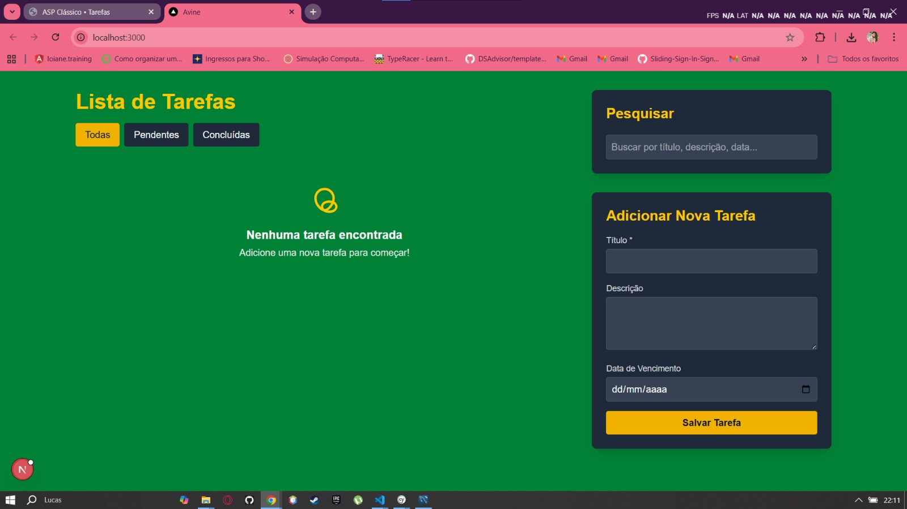
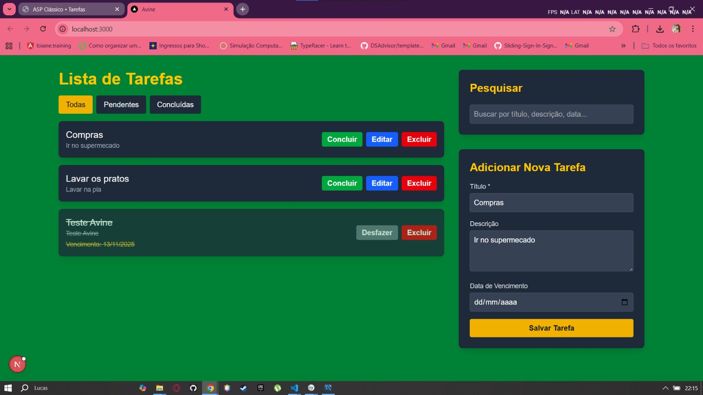
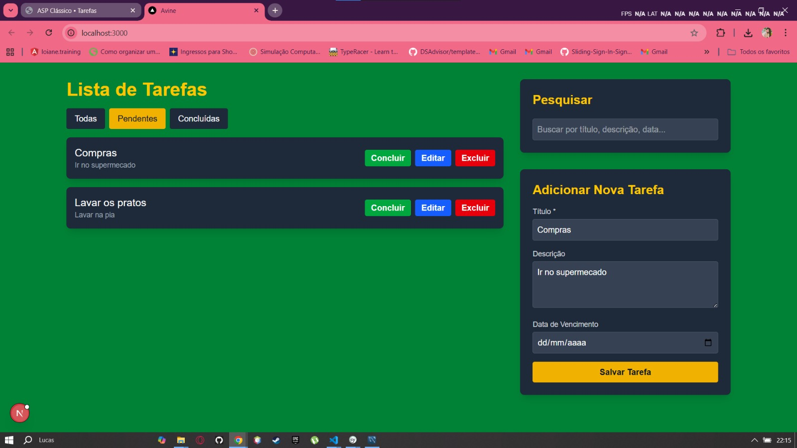
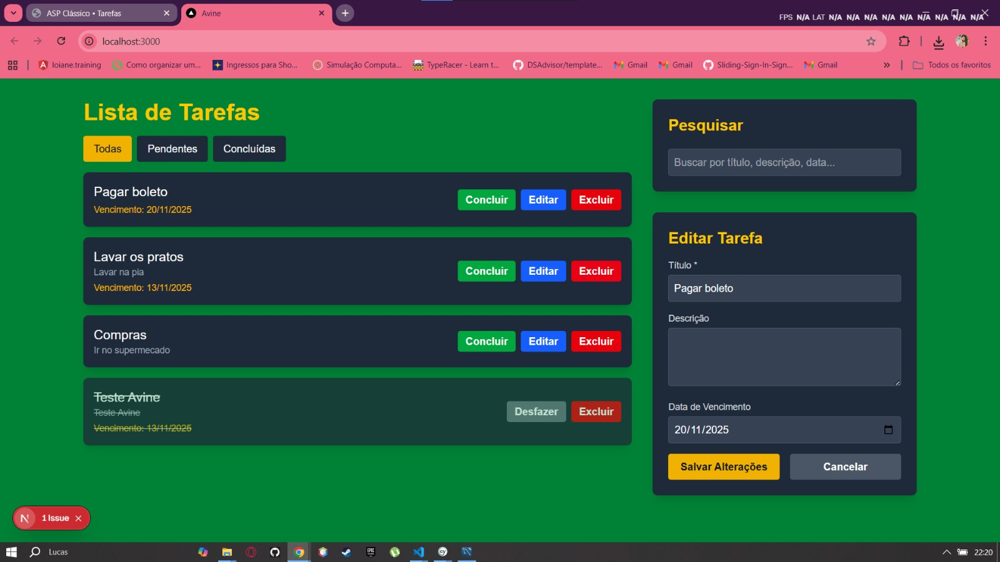
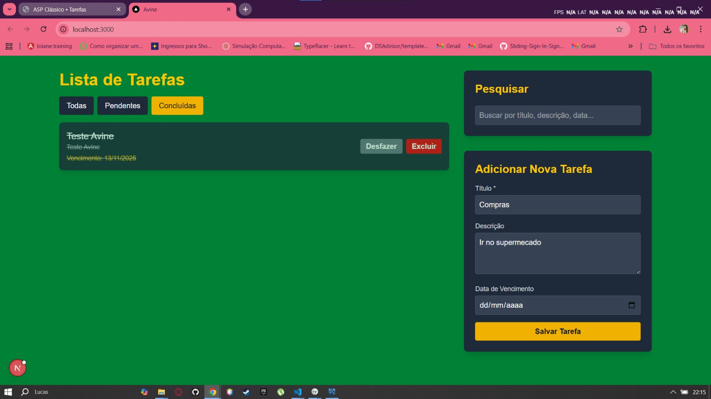
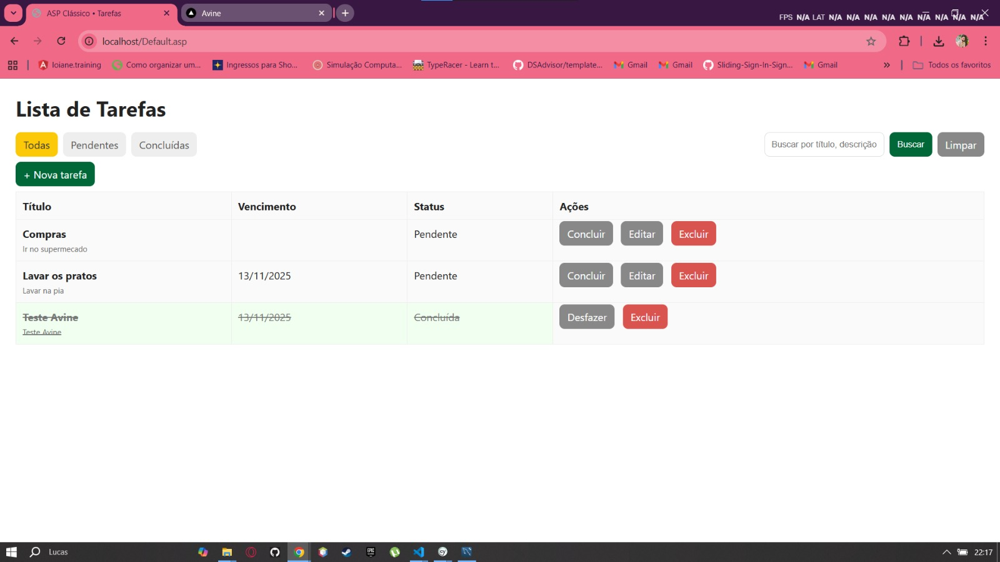
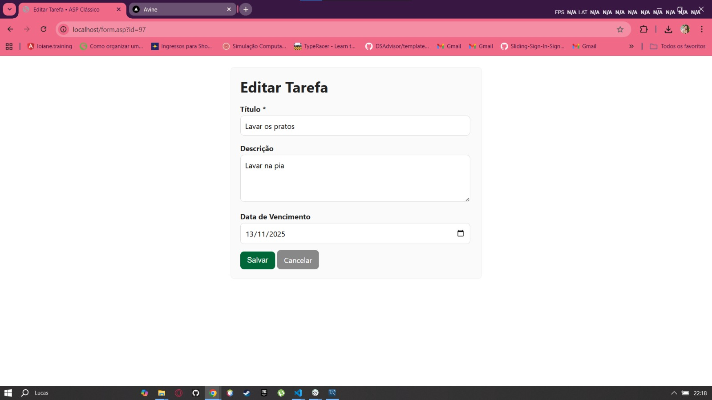

# <div align="center"></div>

# Desafio Técnico: To-Do List (Avine)

Desenvolver uma aplicação web de gerenciamento de tarefas (To-Do List) onde os usuários podem criar, visualizar, editar e excluir tarefas. A aplicação deve ter uma interface amigável com **ReactJS (NextJS)**, um **back-end em C#** e uma API para comunicação com o front-end. Também deve ter uma versão da aplicação em **ASP clássico**.

---

## 📸 Screenshots


### 🟦 Stack Modern (React + C#)

<p align="center"></p>
<p align="center"></p>
<p align="center"></p>
<p align="center"></p>
<p align="center"></p>

### 🟨 Stack Classic (ASP Clássico)

<p align="center"></p>
<p align="center"></p>
<p align="center"></p>
<p align="center"></p> 

---

## ✨ Funcionalidades

Ambas as stacks implementam um CRUD completo e estável com tratamento de erros.

| Funcionalidade            | Modern             | Classic (ASP)         |
| ------------------------- | ------------------------------------ | -------------------------- |
| **CRUD Completo**         | ✅ Sim                                | ✅ Sim                      |
| **Marcar como Concluída** | ✅ Sim                                | ✅ Sim                      |
| **Filtros de Status**     | ✅ (botões)                           | ✅ (botões)                 |
| **Busca abrangente**      | ✅ Título, descrição e data           | ✅ Título, descrição e data |
| **Ordenação inteligente** | ✅ Novas no topo, concluídas no final | ✅ Igual                    |
| **Validação / Erros**     | ✅ Modais customizados                | ✅ `confirm()` + VBScript   |
| **Layout**                | Grid moderno (2 colunas)             | Tabela simples HTML        |

---

## 🛠️ Tecnologias Utilizadas

### 🟦 Stack Modern

* **Backend:** C# (.NET 8 Web API)
* **Frontend:** ReactJS (Next.js 14)
* **Estilização:** Tailwind CSS
* **Linguagem:** TypeScript
* **Testes:** Cypress (E2E)

### 🟨 Stack Classic

* **Servidor:** Microsoft IIS
* **Linguagem:** VBScript
* **Driver:** MySQL ODBC (ANSI, 32 bits)
* **Estilo:** CSS inline

### 🗄️ Banco de Dados

* **MySQL** (schema: `avine_tarefas_db`)

---

## 🛢️ Configuração do Banco de Dados

1. Execute o arquivo `database.sql` (raiz do projeto) para criar:

   * Banco: `avine_tarefas_db`
   * Tabela: `tarefas`

2. **Credenciais padrão:**

   * Usuário: **root**
   * Senha: **avine123!**

3. Caso altere sua senha MySQL, ajuste nos arquivos:

   * `modern-stack/api/AvineApi/appsettings.json`
   * `classic-stack/Default.asp`
   * `classic-stack/form.asp`
   * `classic-stack/delete.asp`
   * `classic-stack/toggle.asp`

---

## 🚀 Modern 

Você precisará de **dois terminais**.

### 🖥️ A. Iniciando o Backend 

```bash
cd modern-stack/api/AvineApi
dotnet run
```

### 🌐 B. Iniciando o Frontend 

```bash
cd modern-stack/client
npm install
npm run dev
```

---

## 🏛️ Classic 

> ⚠️ **Exige configuração manual no IIS**

### ✔️ Configurando o Pool de Aplicativos

1. Abra o **Gerenciador do IIS**
2. Vá para *Pools de Aplicativos*
3. Selecione **DefaultAppPool**
4. Clique em **Configurações Avançadas**
5. Ative: **Habilitar Aplicativos de 32 Bits = True**

### ✔️ Deploy Local (Adicionar Aplicativo)

1. Clique com botão direito em **Default Web Site**
2. *Adicionar Aplicativo...*
3. Alias: `avine-classic`
4. Pool: `DefaultAppPool`
5. Caminho físico → pasta **classic-stack**

---

## 🧪 Testes E2E (Cypress)
1. Certifique-se de que Backend está rodando
2. No diretório do frontend moderno:
```bash
npx cypress open
````

3. Selecione **E2E Testing**
4. Execute o teste: `todo_crud.cy.ts`

---

## ✍️ Autor

**Lucas Ferreira**

* LinkedIn: [https://www.linkedin.com/in/lcasferreidev/](https://www.linkedin.com/in/lcasferreidev/)
* GitHub: [https://github.com/LcasFerrei](https://github.com/LcasFerrei)
* Email: [lucasferreiraceara@gmail.com](mailto:lucasferreiraceara@gmail.com)
